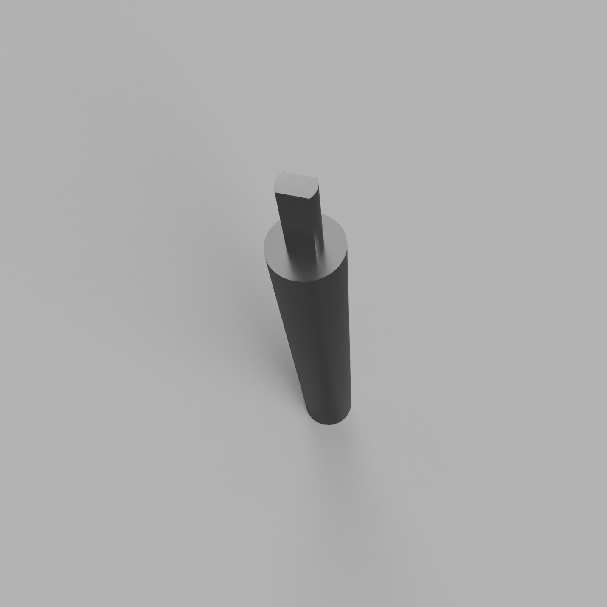
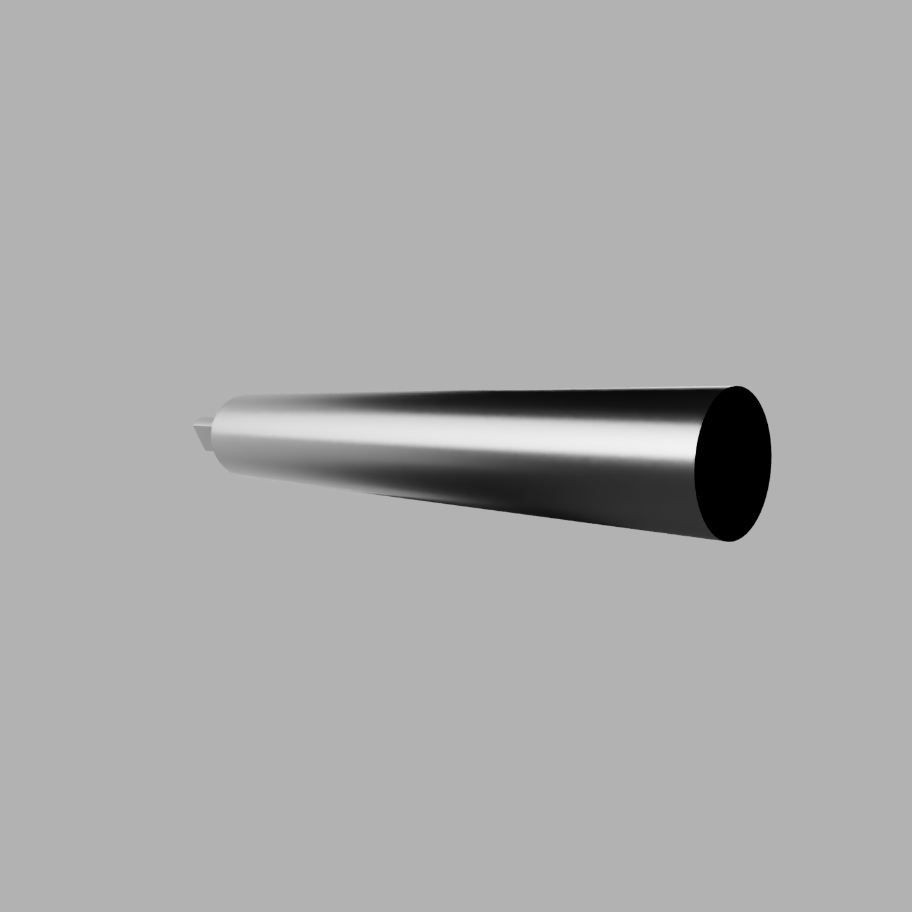
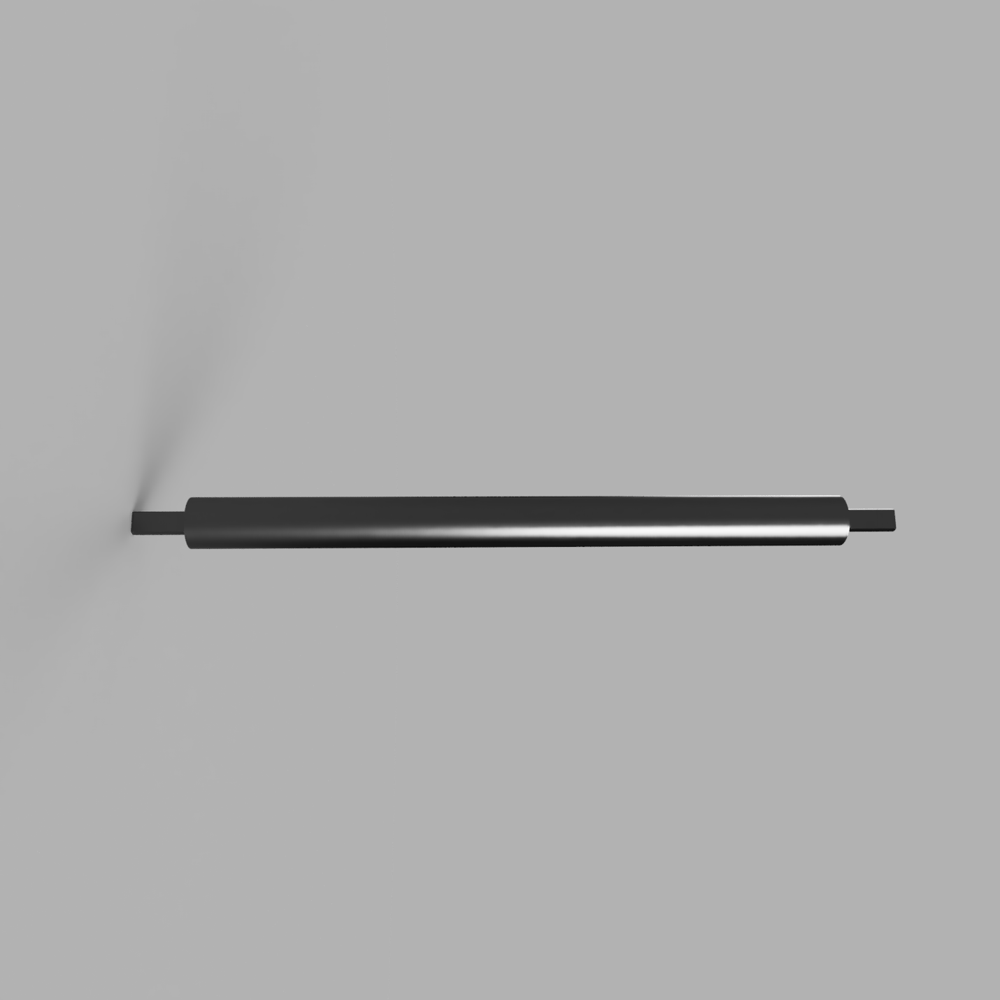
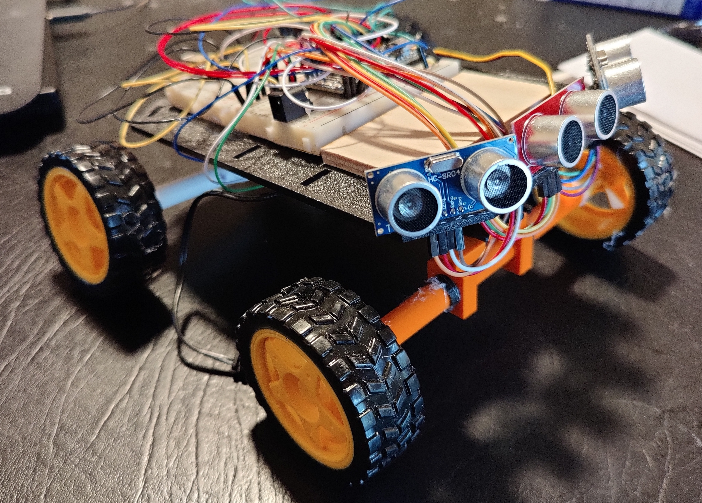
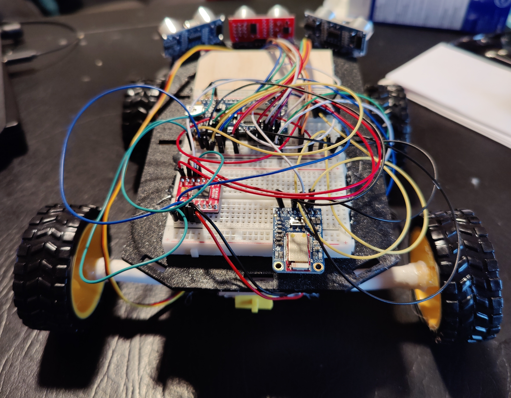

# Remote Control Car
### GT ECE 4180 Final Project

##### Team Members
Raj Madisetti and Arjun Sonti

### Project Idea
Our idea for this project was to create a remote control car that is operated by an mbed microcontroller in order to allow basic forward, reverse, and turning movements along with autopilot functionality. All user inputs would be sent via the Adafruit Bluefruit LE Connect App available on all mobile phones allowing for an easy and convenient experience. For autopilot, three sensors would be mounted on the front to allow the RC car to detect obstacles and turn accordingly. 

### Parts List
- mBed LPC1768 Microcontroller
- 3 HC-SR04 Sonar Sensors
- Dual H-Bridge Motor Driver Chip
- Adafruit Bluetooth LE UART Friend
- Barrel Jack for Breadboard Power
- 4 AA Battery Portable Power Supply
- RC Servo Motor with 3-pin Servo Connector
- DC Brushless Motor
- 4 Wheels
- 2 Breadboards
- Platform to house components on (Approx. 3 breadboards long X 1 breadboard wide)
- 4 Axles (3D Printed to match the Servo and Brushless DC motors connections to the Wheels)

### Schematic

### Hardware Pin Connections
##### Center HC-SR04 Sonar Sensor 
- GND --> mbed GND
- Trig --> mbed pin 6
- Echo --> mbed pin 7
- Vcc --> mbed Vu (5V)

##### Right HC-SR04 Sonar Sensor 
- GND --> mbed GND
- Trig --> mbed pin 15
- Echo --> mbed pin 16
- Vcc --> mbed Vu (5V)

##### Left HC-SR04 Sonar Sensor 
- GND --> mbed GND
- Trig --> mbed pin 17
- Echo --> mbed pin 18
- Vcc --> mbed Vu (5V)

##### Dual H-Bridge Motor Driver 
- GND --> mbed GND
- PWMA --> mbed pin 21
- AI2 --> mbed pin 22
- AI1 --> mbed pin 23
- AO2 --> Red Brushless DC Motor lead 
- AO1 --> Black Brushless DC Motor lead
- VM --> mbed Vu (5V)
- Vcc --> mbed VOut (3.3V)

##### Adafruit Bluetooth LE UART Friend
- GND --> mbed GND
- CTS --> mbed GND
- RXI --> mbed pin 13
- TXO --> mbed pin 14
- VIn --> mbed Vu (5V)

##### Barrel Jack (External Power)
- Vcc --> mbed VIn
- GND --> mbed GND

### 3D Part Renders

## Final Product
### Side View of RC Car

### Rear View of RC Car

